# Walk Anglesey Blog Website

Walk Anglesey is a blogging website focused on sharing walking routes and encouraging a vibrant community of users passionate about exploring the Isle of Anglesey. 

The website offers detailed walk guides, user-contributed posts, weather information, and an interactive map to help users discover and enjoy the amazing walks on offer. Let's [Walk Anglesey!](https://walk-anglesey-84445998906a.herokuapp.com/)

### [View Walk Anglesey hosted on Heroku](https://walk-anglesey-84445998906a.herokuapp.com/)

  
   

## User Experience 

### Website Concept 

[Walk Anglesey](https://walk-anglesey-84445998906a.herokuapp.com/) is a new walking blog website built from the ground up, with 2 main goals. To showcase the fantastic walks on Anglesey and to create a community. By developing a welcoming and easy to use website, we want to attract new users to become part of our walking family.

To create a passionate community, we welcome new users to comment on our walk posts, sign up to newsletters and also to get in touch with us and become bloggers themselves, so they can share their love and knowledge of walks on Anglesey.

### Key Features of the Website

* Welcome page with key information about the website.
* Interactive Map with walk route locations.
* Highly Detailed Walk route information.
* Pictures of each walk and points of interest along the route.
* Difficulty rating for each walk.
* Live Weather information.
* Comment on walk blogs.
* Collaboration form for users to get in touch with site owner.
* Newsletter that site users can sign up to.

### User Stories

#### Owner/Admin Goals

* The website needs to be responsive on all devices to ensure a good user experience.
* Ease of use for admin users to create, edit, and delete their own walk blogs and owner can manage all content.
* Ability to moderate comments and manage user interactions to maintain a positive community environment.
* Users wishing to collaborate can be viewed and managed in the back end, facilitating easy communication and coordination.

#### Registered User Goals

* Ability to create an account and log in securely.
* Option to comment on blog posts, sharing their thoughts and experiences about different walks.
* Has the ability to reach out to site owner to recommend walks or become a blogger themselves.
* Option to sign up for newsletters to stay updated on new walks, community news, and other relevant information.

#### Visitor Goals

* Easy navigation to explore the website and find information about various walks on Anglesey.
* Access to general content without needing to register, such as detailed walk guides, maps, and weather information.
* Encouragement to register for an account to access more features and participate in the community.
* Access to subscribe form to join the Newsletter group.

## Design

### Colour Scheme

The colour scheme selected for the website is inspired by nautical themes, reflecting the fresh and vibrant colours walkers would encounter on their coastal walks around Anglesey. The design aims to create a clean, uncluttered, and welcoming environment for users, enhancing their browsing experience and making navigation intuitive.

These are the colours used:

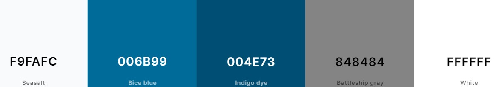

The color scheme features #F9FAFC for a light, airy background, #006b99 for primary text and buttons representing the sea, #004e73 for dynamic hover effects, #fff for clean text and backgrounds, and #848484 for neutral secondary elements with vibes of coastal rocks, creating a cohesive and uncluttered nautical theme.

### Typography

We selected "Lato" for its modern and friendly look, using bold for headings to draw attention and lighter weights for body text to ensure readability. Additionally, "Helvetica" is used in the walk blogs to provide a clear and professional appearance, complementing the overall clean design of the website.

### Imagery & Layout

The website is designed to look great on any device, from desktops to mobile phones, so you get a smooth experience no matter how you browse. We've made sure navigation, the interactive map, weather information, and walk guides are easy to find and use.

Imagery plays a crucial role in the design, with high-quality photos of Anglesey’s landscapes enhancing the visual appeal and providing a glimpse of the stunning walks available. Each guide is packed with pictures of interesting spots along the way, making the content engaging and fun.

With a carefully chosen colour scheme, typography, and layout, Walk Anglesey aims to create a welcoming and user-friendly site that invites you to explore and be part of our walking community.

## Features

The Website consists of a Responsive Navbar and Footer, a Homepage, a Walks page, About page and a Newsletter sign up page.

## All pages on the website are responsive and have:

* favicon in the web browser tab:

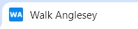

* Every page has a responsive Navbar:

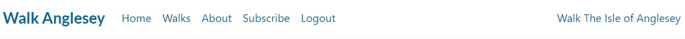

* There is a footer with social media links on each page:

## The Home Page

* A large header image taken by the site owner.

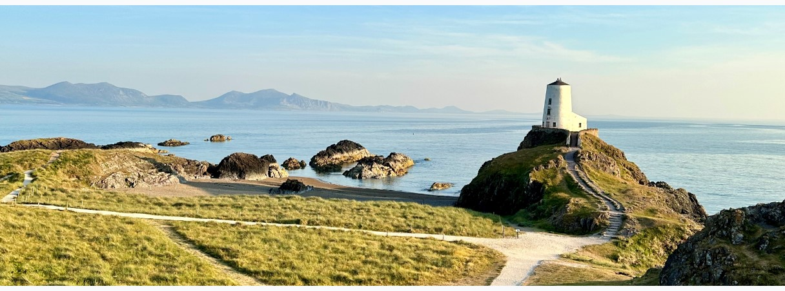

* Introductory text, A section with a detailed introduction about the website, its purpose, and the types of walking routes and experiences available on Anglesey.

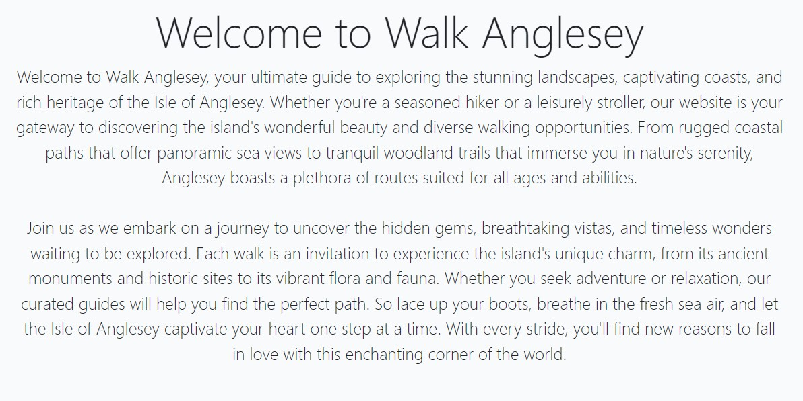

* The Interactive map, an embedded Google Map to display walking route locations, enhancing the user's ability to explore visually.

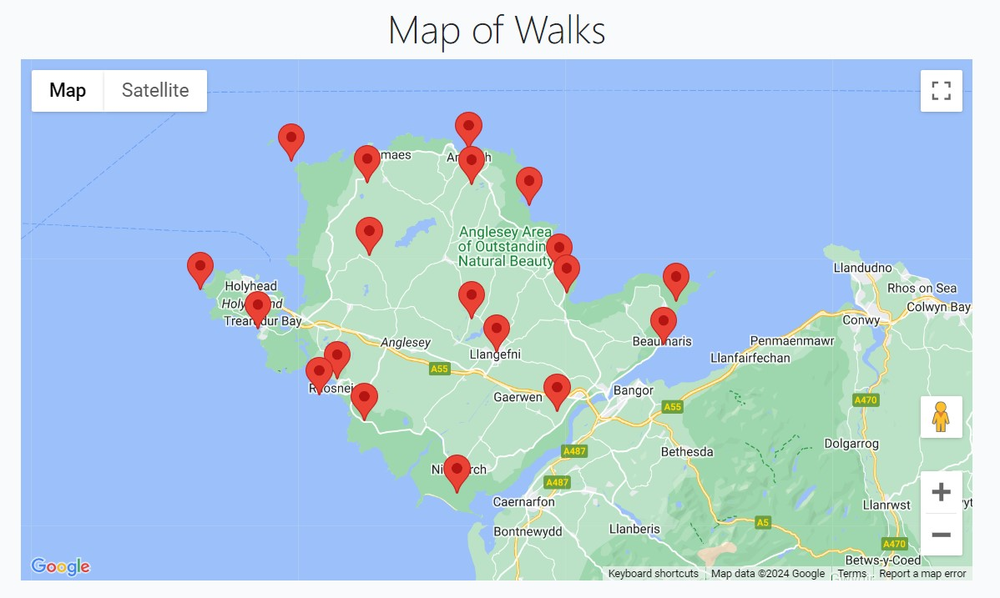

* A section titled "Walk Blogs" to highlight recent posts. Blog entries displayed in a card layout with images, titles, excerpts, and authors. Pagination to navigate through multiple blog post pages if needed. These blogs are selected from the back end in a random format 

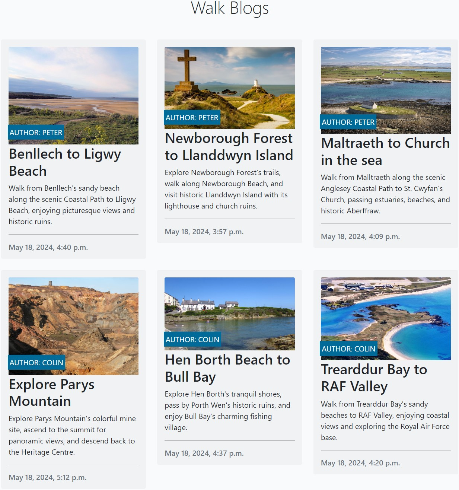

## Walk Blog List Page

* The Walks blog page starts with a randomised image from one of the walk blogs, to offer a unique experience each time a user visits the page. Following that is a list of all the walk blogs featured on the site.

## Walk Blog Detail

* The top of the page includes a large header image that either displays the featured image of the post or a default placeholder image. Overlaid on this image are the title, author, creation date, and difficulty level of the walk.

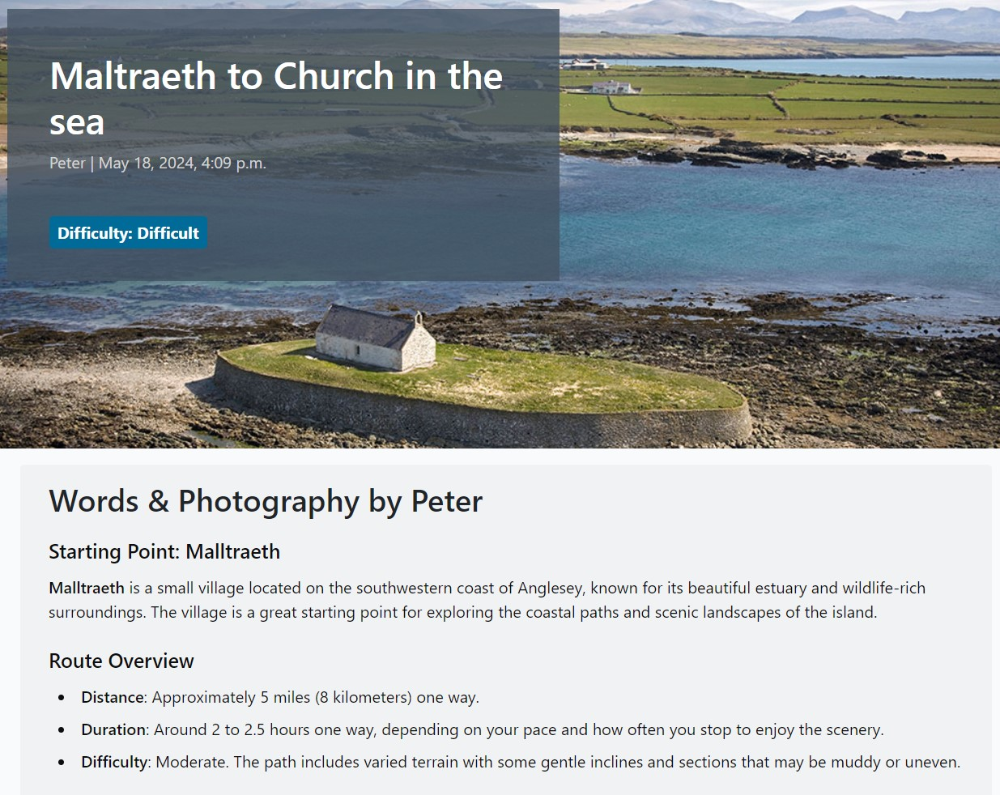

* The main content area displays the detailed description of the walk. This includes the author’s narrative and photographs related to the walk, making it informative and engaging highlighting the points of interest walkers will see along the way.

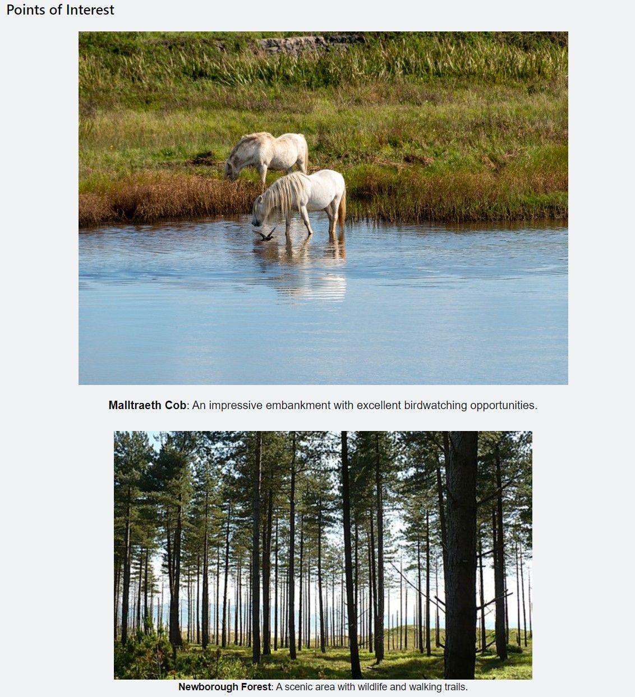

* Beneath the main walk content follows a map of the walking route, allowing users to visualize the path. Additionally, it includes real-time weather information for the location, helping users prepare for their walk.

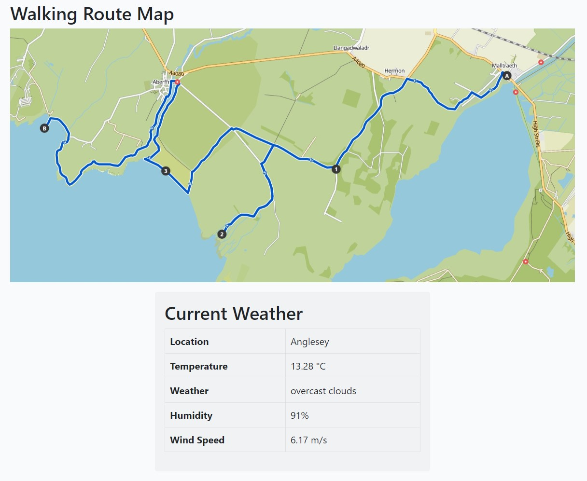

* Below the post content and route map and weather, there is a section that displays comments left by other users. Each comment shows the author, creation date, and content, fostering community interaction. Users must be logged in to view comments.

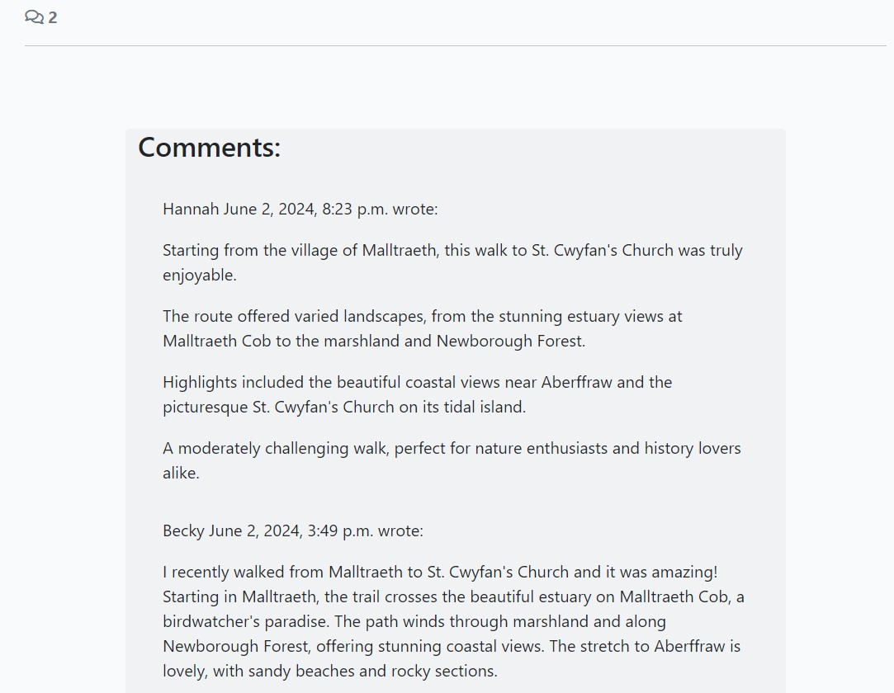

* Users can create, delete or edit their own comments, and unapproved comments are marked for the user’s awareness, awaiting admin approval.

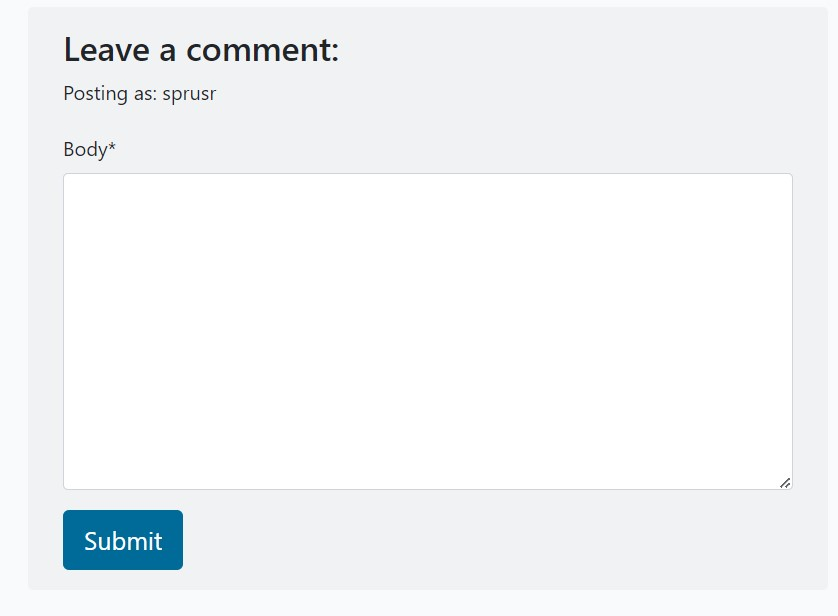

## About Us Page

* The About Us page contains useful information about the group of walkers that make up this passionate group. This content is created on the back end django administration.

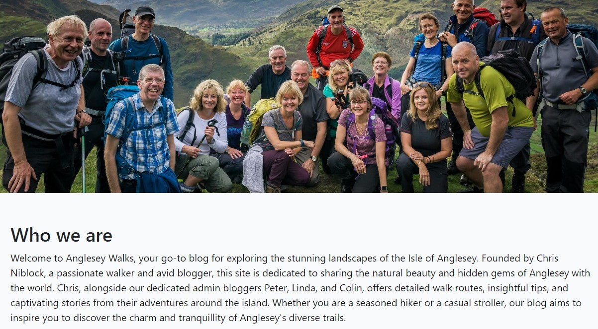

* Registered and logged-in users can complete a form for either a walk suggestion or a request to join the walk blog team. This encourages engagement and allows users to share their thoughts and experiences related to the walk.

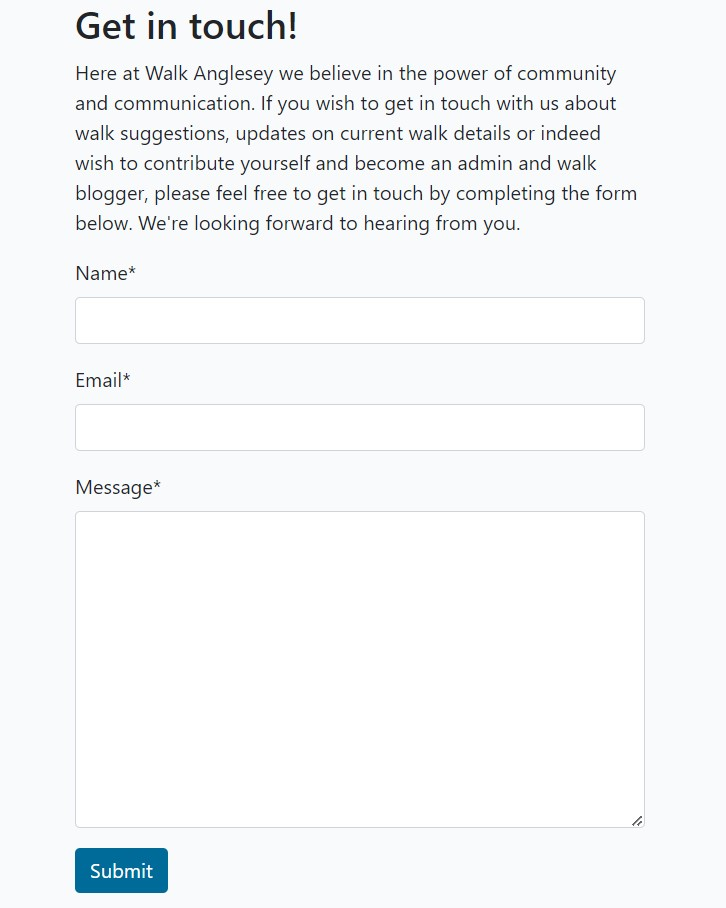

### Newsletter Subscription Page

* The Subscribe page also contains a hero image which is randomly selected from the walk blogs. Following that is some information for the user and an email and submit function. This information is then sent to the back end for the site owner to send out the Newsletters.

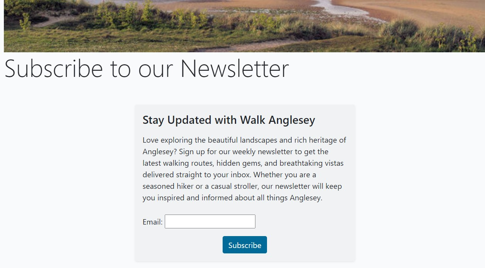

### Future Implementations

In future updates, we plan to add the following features to enhance the user experience and functionality of the Walk Anglesey website:

* **User Profiles**: Allow users to create and customize their own profiles.
* **Favorite Walks**: Enable users to save their favorite walks for easy access later.
* **Like Functionality**: Implement a like feature for users to express their appreciation for specific walks and posts.
* **Wildlife Section**: Add a dedicated section for wildlife sightings and information, enriching the content with details about the flora and fauna encountered on walks.
* **Photo Drop Box**: Create a section where users can share their own images from walks, contributing to a community-driven gallery.
* **Social Sharing**: Integrate social media sharing options for users to share walks on their social networks.

These features aim to build a more interactive, engaging, and community-focused platform for all users.

### Accessibility 

We are committed to making Walk Anglesey accessible to all users, including those with disabilities. Future implementations will include:

## Technologies Used

### Languages Used

* **HTML5**: For structuring the content.
* **CSS3**: For styling the content.
* **JavaScript**: For interactive elements and functionalities.
* **Python**: For back-end development with Django framework.

### Frameworks, Libraries and programmes used

* **Django**: A high-level Python web framework that encourages rapid development and clean, pragmatic design.
* **Bootstrap**: A popular front-end framework for developing responsive and mobile-first websites using HTML, CSS, and JavaScript.
* **Django Allauth**: A package for Django that provides a comprehensive set of user authentication, registration, and account management tools.
* **Cloudinary**: A cloud-based service that offers comprehensive image and video management, including storage, transformation, and delivery.
* **Google Maps API**: An application programming interface that allows you to embed Google Maps on your web pages and customize them with your own content.
* **OpenWeatherMap API**: A service that provides weather data, including current weather, forecasts, and historical data to developers through an API.
* **Django Crispy Forms**: A Django application that helps you create beautiful, Bootstrap-compatible forms easily.
* **Django Summernote**: A package for integrating the Summernote WYSIWYG editor into Django projects, enabling rich text editing.
* **Gunicorn**: A Python WSGI HTTP server for running web applications, commonly used to serve Django applications in production.
* **Whitenoise**: A middleware for Django that helps serve static files efficiently in production.
* **PostgreSQL**: An advanced, open-source relational database management system known for its reliability and robustness.

## Deployment & Local Development

### Agile Development

When building this project, I used Agile methodology to keep things flexible, collaborative, and always improving. I broke down the project into smaller chunks and worked on each piece one at a time, making sure each part was solid before moving on to the next.

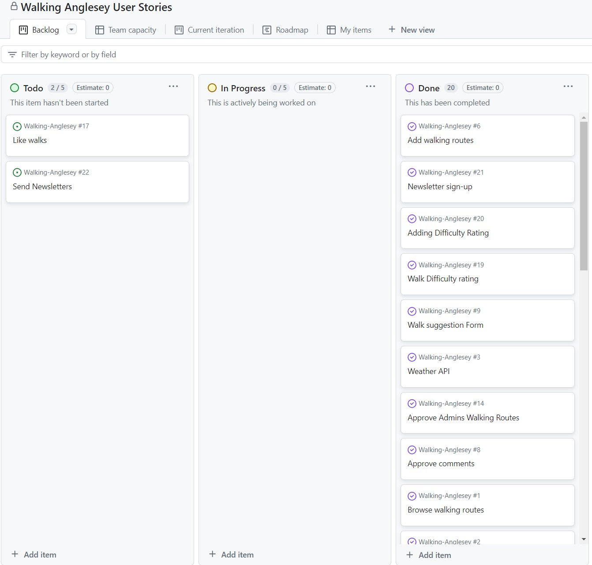

[Here is the current Project Board.](https://github.com/users/cniblock/projects/4)

To define the project's scope and requirements, I used user stories with each story having a clearly defined set of acceptance criteria. This allowed me to ensure that everyone involved in the project shared a common understanding of what needed to be built and how it would be tested. However, due to time constraints, two user stories were prioritized as "won't have" using the MOSCOW model, meaning they will be part of the future development of the site.

### Models

The following models are used in this application:

### Entity Relationshop Diagram

#### Post Model

The Post model represents a blog post or article. It has the following fields:

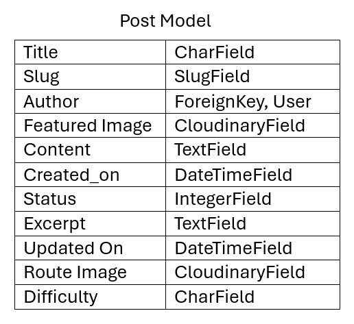

The Post model has a many-to-one relationship with the User model through the author foreign key.

#### Comment Model

The Comment model represents a comment left on a blog post. It has the following fields:

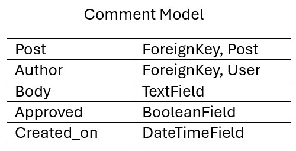

The Comment model has a many-to-one relationship with the Post model through the post foreign key.

#### Newsletter Model

The NewsletterSubscriber model represents a subscriber to a newsletter. It has the following fields:

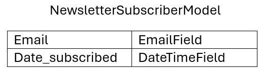

### Forms

### Views

### URLs

### Template

## Testing

* HTML Validation Pass

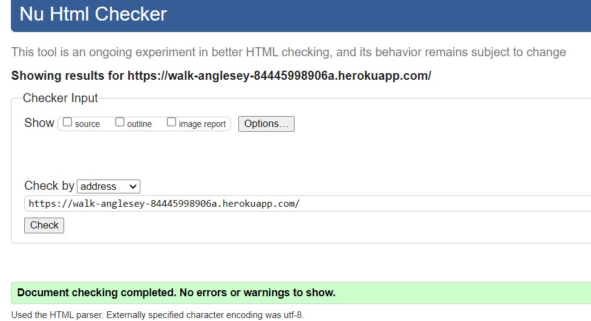

w3c Validation Pass

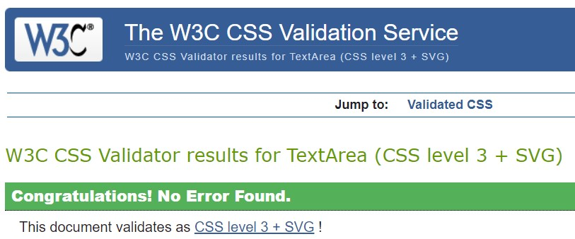

### Bugs

## Credits

### Code used

### Content

### Media

### Acknowledegments 